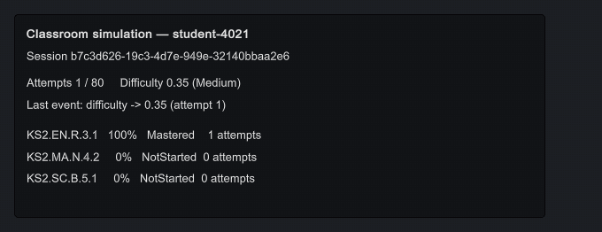
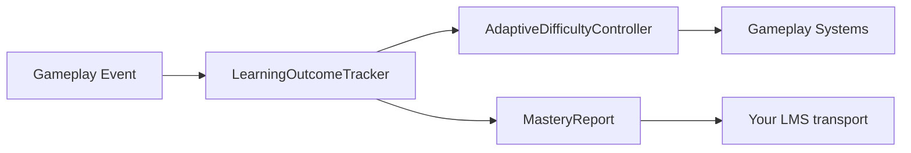

# Educational Gamification Systems for Unity

[](https://github.com/Ocean-View-Games/educational-gamification-systems-unity/actions/workflows/validate.yml)
[](https://unity.com)
[](LICENSE)

A collection of open-source C# utility scripts for building curriculum-aligned educational games in Unity. These systems handle learning outcome tracking and adaptive difficulty, covering the measurement layer that educational games need and entertainment titles do not. Built and maintained by [Ocean View Games](https://oceanviewgames.co.uk/services/educationalgames), a UK studio specialising in educational game development.



*The included [Classroom Simulation sample](Samples~/ClassroomSimulation/): a capable student is pushed from Medium up to the Hard tier as the controller finds their level, while per-objective accuracy and mastery update live.*

## Features

- **LearningOutcomeTracker**: tracks student attempts against curriculum-coded objectives (e.g. KS2.EN.R.3.1), calculates mastery levels, and generates structured reports for LMS export.
- **AdaptiveDifficultyController**: dynamically adjusts game difficulty based on recent student performance, keeping learners in their zone of proximal development.
- **Editor tooling**: a custom Editor window for viewing learning objectives, monitoring mastery progress during play mode, and exporting reports as JSON.
- **Runnable sample**: a Classroom Simulation importable from the Package Manager, showing both systems working together with no scene setup.
- **Architecture documentation**: detailed docs covering data flow, component interaction, and school deployment considerations.

## Installation

Install via Unity Package Manager using **Add package from git URL**:

```
https://github.com/Ocean-View-Games/educational-gamification-systems-unity.git
```

Alternatively, copy the `Runtime/` and `Editor/` folders into your project's `Assets/` directory. The included assembly definitions keep the runtime and editor code in their own assemblies either way.

## Quick Start

1. Add a `LearningOutcomeTracker` component to a GameObject in your scene.
2. Add an `AdaptiveDifficultyController` component and assign the tracker reference.
3. Register learning objectives, identify the student, and start recording attempts from your game code:

```csharp
using OceanViewGames.EdTech;

var tracker = GetComponent<LearningOutcomeTracker>();

// Register an objective.
tracker.RegisterObjective(new LearningObjective
{
    objectiveId = "KS2.EN.R.3.1",
    description = "Retrieve and record information from non-fiction texts",
    subject = "English",
    masteryThreshold = 0.85f
});

// Identify the student. This also issues a fresh session ID and clears any
// previous progress, so one tracker can serve a succession of students on
// shared classroom hardware.
tracker.StartSession("student-4021");

// Record a student attempt.
tracker.RecordAttempt("KS2.EN.R.3.1", correct: true, responseTimeSeconds: 4.2f, activityId: "reading-comprehension-01");

// React to difficulty changes. Subscribe before the first Evaluate() call, or the
// adjustment it makes goes unobserved.
var difficultyController = GetComponent<AdaptiveDifficultyController>();
difficultyController.OnDifficultyChanged.AddListener(d => Debug.Log($"Difficulty now {d:0.00}"));
difficultyController.OnTierChanged.AddListener(tier => Debug.Log($"Tier now {tier}"));

// Evaluate difficulty after recording attempts.
difficultyController.Evaluate();

// Export a mastery report as JSON.
string reportJson = tracker.GenerateReportJson();
```

4. Open the Editor window via **Ocean View Games > Learning Outcome Viewer** to inspect objectives and export reports during play mode.

## Sample

The package ships one importable sample, **Classroom Simulation**, available from **Window > Package Manager > Educational Gamification Systems > Samples**. It needs no scene setup: add the **Classroom Simulation Sample** component to an empty GameObject and press Play.

A simulated student with a fixed latent ability answers questions across three curriculum objectives. Harder questions are answered correctly less often, so as the controller raises difficulty the observed accuracy falls, and the two settle into the band between the controller's decrease and increase thresholds. A capable student is pushed to the Hard tier and a struggling one is eased to Easy, both ending up answering roughly six questions in ten — which is the controller working, not failing.

An on-screen readout shows accuracy, mastery level, and attempt count per objective alongside the live difficulty and tier. The full JSON report is written to the Console when the lesson ends.

Full notes in [Samples~/ClassroomSimulation/README.md](Samples~/ClassroomSimulation/README.md).

## Architecture

The system separates game mechanics from learning analytics, allowing designers to iterate on gameplay without breaking the educational measurement layer.



**LearningOutcomeTracker** sits at the centre. It receives gameplay events, stores attempt records, and calculates mastery levels using UK assessment terminology (NotStarted, Emerging, Developing, Secure, Mastered). The **AdaptiveDifficultyController** reads this mastery data and adjusts a difficulty value between 0 and 1, firing UnityEvents that gameplay systems subscribe to. At any point, the tracker can generate a **MasteryReport** suitable for JSON serialisation and REST API export to a school's Learning Management System.

For a full architectural breakdown, component diagrams, and school deployment guidance, see [docs/architecture.md](docs/architecture.md).

## Scope and limitations

Worth knowing before you build on this:

- **No persistence.** Attempts are held in memory only. They do not survive a scene load, an editor domain reload, or an application restart. Persisting a session is your responsibility.
- **Bounded raw history.** The tracker retains the latest 1,000 raw attempt records per objective by default, configurable in the Inspector. Lifetime counts, accuracy, mastery, and average response time remain aggregated across the complete session after older raw records roll out.
- **No networking.** The tracker produces JSON; it does not transmit it. Delivering the report to an LMS is left to your own transport layer, so you can meet whatever authentication and endpoint requirements the school's platform imposes.
- **Single student per tracker.** One tracker instance represents one student's session. Use `StartSession` to hand over between students; any connected `AdaptiveDifficultyController` resets to its configured initial difficulty immediately.
- **One evaluation mode per controller.** `Evaluate()` and `EvaluateForObjective()` track consumed attempts separately, so driving a single controller with both applies shared attempts twice and moves difficulty at twice the configured step. Pick one per controller instance, and add a controller per objective if objectives need independent difficulty. The controller warns once if it detects both being used.
- **Handle student data carefully.** Reports contain an identifier plus aggregated correctness and response-time statistics. In UK schools that is personal data about children. **Pass a pseudonymous token to `StartSession`, never a child's name.** Response-time data in particular supports inferences well beyond the objective being measured, so retention limits, access controls, and what the school has told parents are decisions to settle before deployment — not defaults this library can set for you.

## Mastery levels

Mastery is assessed against each objective's configurable `masteryThreshold` (T, where 0 < T <= 1). The Secure and Developing bands sit proportionally beneath it, so lowering the threshold lowers the whole ladder rather than making the middle bands unreachable:

| Level | Accuracy | At default T = 0.85 |
| --- | --- | --- |
| NotStarted | no attempts recorded | — |
| Emerging | below 0.41 x T | below 0.35 |
| Developing | 0.41 x T to 0.76 x T | 0.35 to 0.65 |
| Secure | 0.76 x T to T | 0.65 to 0.85 |
| Mastered | at or above T | 0.85 and above |

## Tests

94 Play Mode test cases covering mastery banding, session handling, bounded history, report generation, difficulty adjustment, evaluation mode misuse, component lifecycle, event wiring, defensive snapshots, and input guards live in [Tests/Runtime/](Tests/Runtime/).

Open **Window > General > Test Runner**, select the **PlayMode** tab, and run them. They are Play Mode rather than Edit Mode tests because both components rely on `Awake`, which Unity only invokes on `AddComponent` while playing.

When the package is installed from Git, add it to the consuming project's `Packages/manifest.json` so Unity exposes its tests:

```json
{
  "testables": [
    "uk.co.oceanviewgames.edtech"
  ]
}
```

Embedded packages are already considered in development and do not need this entry.

The test assembly is constrained to `UNITY_INCLUDE_TESTS`, so it compiles in this package's own development project and is excluded from consumer projects. No test dependency is added to `package.json`.

### Running the tests headlessly

On Windows, [Tools~/verify.ps1](Tools~/verify.ps1) does the whole job:

```powershell
.\Tools~\verify.ps1
```

It assembles a throwaway project that installs this package as a dependency, copies the samples in so they are compiled too, runs the Play Mode suite in batch mode, and prints a pass/fail summary, exiting non-zero on failure. The scratch project is reused between runs so Unity's `Library` cache survives; pass `-Clean` to force a full reimport, or `-UnityVersion 6000.0.73f1` to pin an editor rather than taking the newest installed.

Compiling the samples is part of the point: they live in `Samples~`, which Unity ignores, so nothing else would catch one drifting out of sync with the runtime API.

The underlying command, for other platforms or for CI of your own:

```
Unity.exe -batchmode -nographics \
  -projectPath <consuming-project> \
  -runTests -testPlatform PlayMode \
  -testResults results.xml \
  -logFile unity.log
```

Point `-projectPath` at a project that lists this package in its `Packages/manifest.json` along with the `testables` entry above. Testing through a consuming project rather than embedded source exercises the package the way a studio would actually receive it.

### Continuous integration

[.github/workflows/validate.yml](.github/workflows/validate.yml) checks package metadata, assembly definition validity, declared sample paths, and `.meta` file consistency on every push and pull request. It needs no Unity licence, so it runs on forks and on pull requests from outside the organisation.

The Play Mode suite is deliberately **not** run in CI. Doing so requires a Unity account password and licence file stored as repository secrets, which is a poor trade for a package this size — and because GitHub withholds secrets from forked pull requests, an outside contributor's PR would show a permanently failing check regardless. The tests are run locally against each release using the command above; the command is documented here so anyone can reproduce the result rather than take it on trust.

## Requirements

- Unity 6000.0.73f1 or later
- No third-party dependencies

The suite is run against 6000.0.73f1 and 6000.3.22f1 before each release. Earlier editors are not claimed rather than known broken: nothing in the package obviously needs Unity 6 — the whole editor-side API surface is `EditorGUI`, `EditorGUILayout`, and `JsonUtility`, and the C# 8 and 9 features it uses have been available since 2021.2 — but an untested version is not a supported one, so the manifest states what has actually been verified.

## Related Reading

- [Gamifying Language Learning in EdTech](https://oceanviewgames.co.uk/blog/posts/gamifying-language-learning-edtech): a deep dive into adaptive difficulty and engagement in vocabulary games.
- [Educational Games Services](https://oceanviewgames.co.uk/services/educationalgames): Ocean View Games' educational game development offering.
- [Education Industry](https://oceanviewgames.co.uk/industries/education): how we work with schools, publishers, and EdTech companies.

## About Ocean View Games

[Ocean View Games](https://oceanviewgames.co.uk) is a London-based Unity development studio. We build educational games, serious games, and interactive experiences for cultural institutions, publishers, and EdTech companies. Find us on [LinkedIn](https://www.linkedin.com/company/ocean-view-games) and [Clutch](https://clutch.co/profile/ocean-view-games).

## Licence

MIT — see [LICENSE](LICENSE).

The licence covers the code and documentation in this repository. It does not grant rights to the Ocean View Games name, logo, or other brand assets.

## Trademarks

Unity is a trademark of Unity Technologies. This project is not affiliated with, endorsed by, or sponsored by Unity Technologies.

All other product and company names mentioned in this repository are the trademarks of their respective owners, referenced here for identification purposes only. Their use does not imply any affiliation with or endorsement by them.
