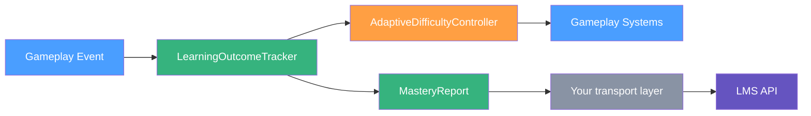
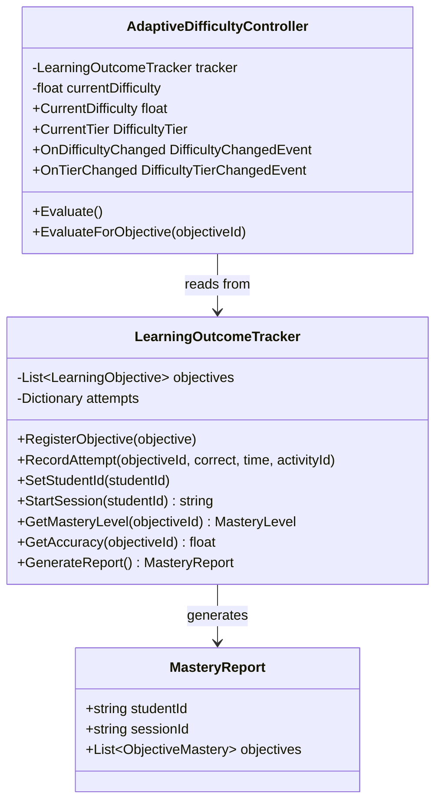

# Architecture: Curriculum-Aligned Educational Games in Unity

This document describes the high-level architecture used by [Ocean View Games](https://oceanviewgames.co.uk) when building curriculum-aligned educational games in Unity. It covers how the core systems in this repository fit together and outlines deployment considerations for builds targeting schools.

## Overview

Educational games differ from entertainment titles in one critical respect: every gameplay interaction must serve a measurable learning objective. The architecture described here separates game mechanics from learning analytics, allowing designers to iterate on fun factor without breaking the educational measurement layer.

The two core systems are:

1. **LearningOutcomeTracker** records student attempts against curriculum-coded objectives and calculates mastery levels.
2. **AdaptiveDifficultyController** reads mastery data and adjusts gameplay difficulty to keep students in their zone of proximal development.

This separation of concerns mirrors the approach we use in production educational titles, where gameplay needs to keep iterating without disturbing the measurement layer beneath it.

## Data Flow

The following diagram shows how data moves through the system during a typical gameplay session.

### Step-by-step flow

1. **Gameplay Event**: The student interacts with a game element (answers a question, completes a puzzle, makes a choice). The game code calls `LearningOutcomeTracker.RecordAttempt()` with the relevant registered objective ID, whether the answer was correct, and the response time. Unknown objective IDs are rejected so a typo cannot silently disappear from reports.

2. **LearningOutcomeTracker**: Stores the attempt and recalculates the mastery level for the associated objective. Mastery levels follow UK assessment terminology: NotStarted, Emerging, Developing, Secure, Mastered. Each attempt is stamped with both a UTC timestamp and a monotonic sequence number; ordering uses the sequence number, because the system clock is coarser than a single frame and timestamps can tie.

3. **AdaptiveDifficultyController**: After recording the attempt, the game calls `AdaptiveDifficultyController.Evaluate()`. The controller examines recent accuracy over a sliding window and adjusts the difficulty value (a float from 0 to 1). Each attempt update can trigger at most one global adjustment, so duplicate callbacks or timer ticks do not amplify unchanged evidence. A new tracker or session resets difficulty to the configured initial value before processing the new learner's attempts. By default, if accuracy exceeds 80% difficulty increases; if it drops below 50% difficulty decreases. Both thresholds are configurable. An inverted pair would make the two branches overlap, raising difficulty for a student who is struggling, so the decrease threshold is collapsed to the increase threshold at the point of use rather than written back to the serialised field. A destructive clamp in `OnValidate` was tried and removed: `OnValidate` fires continuously while a slider is dragged, so a transient inversion mid-drag permanently ratcheted the authored value down with no way to recover it. The authored value is now left intact and takes effect again as soon as the increase threshold is raised, and because the collapse happens at the point of use it applies in player builds too, where `OnValidate` never runs at all. `Awake` logs a warning once if the authored pair is inverted, since the configured decrease threshold is then silently ignored.

   `Evaluate()` and `EvaluateForObjective(objectiveId)` are **mutually exclusive modes**. Each keeps its own cursor over the attempts it has already consumed, so calling both on one controller applies the same attempts twice and moves difficulty at double the configured step. Pick one mode per controller instance, and use one controller per objective if you need independent difficulty states.

4. **Gameplay Systems**: Other game components listen for the `OnDifficultyChanged` and `OnTierChanged` UnityEvents and adjust their behaviour accordingly. For example, a word puzzle might present longer words at higher difficulty, or a history quiz might reduce the number of answer options at lower difficulty. These are declared as concrete `UnityEvent` subclasses (`DifficultyChangedEvent`, `DifficultyTierChangedEvent`) because Unity cannot serialise an open generic type — a bare `UnityEvent<float>` field would never appear in the Inspector.

5. **MasteryReport**: At any point (end of session, teacher request, or periodic sync), the tracker generates a structured `MasteryReport` object containing per-objective mastery data, accuracy, and timing statistics. Every report generated within a session carries the same `sessionId`, so repeated syncs from one sitting can be correlated rather than appearing as separate sessions.

6. **Your transport layer**: This repository stops at JSON. `GenerateReportJson()` hands you a serialised report and nothing more — there is no networking code here. Posting it is deliberately left to the integrator, since school platforms differ in authentication, endpoint shape, and what the local IT policy permits.

7. **LMS API**: The report reaches the school's Learning Management System, allowing teachers to view class-wide progress dashboards without relying on the game itself.

## Component Interaction

## Mastery banding

Each objective carries a configurable `masteryThreshold` (T, default 0.85, where 0 < T <= 1). The intermediate bands are positioned proportionally beneath it rather than at fixed cut-offs:

| Level | Accuracy | At default T = 0.85 |
| --- | --- | --- |
| NotStarted | no attempts recorded | — |
| Emerging | below 0.41 x T | below 0.35 |
| Developing | 0.41 x T to 0.76 x T | 0.35 to 0.65 |
| Secure | 0.76 x T to T | 0.65 to 0.85 |
| Mastered | at or above T | 0.85 and above |

The proportional banding matters when an objective is deliberately set to a lower bar. With fixed cut-offs, a threshold below 0.65 would make `Secure` unreachable and mark a student as `Mastered` at accuracies the fixed bands still considered `Developing`.

## State and lifetime

The tracker holds attempts in memory for the lifetime of the component. There is no persistence layer:

- A scene load, an editor domain reload, or an application restart loses all recorded attempts.
- Raw attempt history is bounded per objective (1,000 records by default), while lifetime summary statistics continue to cover the complete session.
- `ResetAllProgress()` clears attempts but keeps the objectives and the current session ID.
- `SetStudentId(studentId)` can identify a previously anonymous session, including after attempts begin, but an assigned non-empty identifier cannot be replaced in place.
- `StartSession(studentId)` clears attempts, keeps the objectives, issues a new session ID, and immediately resets connected adaptive controllers — the correct call when handing a device to the next student.

If a session needs to survive interruption, snapshot `GenerateReportJson()` at checkpoints and store it yourself.

## Deployment Considerations for Schools

Deploying Unity games into school environments presents constraints that do not apply to consumer titles.

### Network constraints

School networks are often filtered, throttled, or subject to proxy interception. Asset bundles should be kept small (under 5 MB each) and loaded progressively. The initial WebGL build size should target under 10 MB compressed to achieve acceptable load times on slow connections.

Learning analytics sync should tolerate a hostile network: batch reports, retry with backoff, and never block gameplay on a successful POST. A filtered proxy that silently drops your endpoint is a normal Tuesday.

### Browser compatibility

Schools often run managed browsers with restricted extension policies. Test against Chrome (the default on Chromebooks), Edge (common on Windows school PCs), and Safari (iPad deployments). Avoid relying on WebGL 2.0 features that may not be available on older Chromebook GPUs.

### LMS integration

Most school LMS platforms (Google Classroom, Canvas, Moodle) support xAPI or custom REST endpoints for receiving learning analytics. The `MasteryReport` structure is designed to map onto xAPI statements, with each `ObjectiveMastery` entry corresponding to an xAPI result.

One serialisation note: `JsonUtility` writes C# enums as integers, so `masteryLevel` appears in the JSON as a number. `ObjectiveMastery` therefore also carries `masteryLevelName`, a string form intended for xAPI and any other consumer that expects a readable value. Each entry also carries the `masteryThreshold` it was assessed against, so downstream systems can interpret the level without needing the game's configuration.

### Data protection

Mastery reports contain a student identifier alongside aggregated correctness and response-time statistics. In a UK school setting that is personal data about children, and the timing data in particular can support inferences about a learner well beyond the objective being measured.

This library sets no policy and applies no anonymisation. Pass a pseudonymous token to `StartSession` — never a child's name, and never an identifier that resolves to one outside the school's own systems.

Retention limits, access controls, and what the school has communicated to parents belong to the deployment, and should be settled with the school's data protection lead before a pilot rather than after one. Where the processing is likely to result in a high risk to children — large-scale profiling, or inferences about attainment or additional need — a Data Protection Impact Assessment is a legal requirement rather than a formality.

## Further Reading

- [Gamifying Language Learning in EdTech](https://oceanviewgames.co.uk/blog/posts/gamifying-language-learning-edtech): a deep dive into adaptive difficulty in vocabulary games.
- [Educational Games Services](https://oceanviewgames.co.uk/services/educationalgames): Ocean View Games' educational game development offering.
